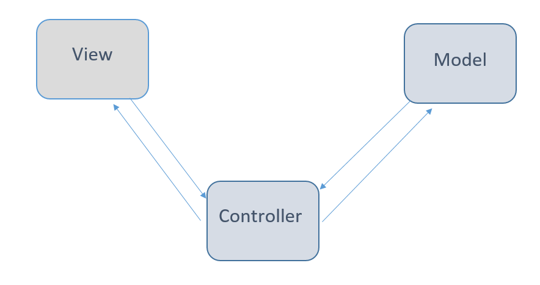

This is a University project that focuses on improving my Java development skills by creating a Vet clinic management software. 
Here I had to:
Use MVC (Model-view-controller) pattern to create the software;
Use SwinGUI to create the user interface;
Use Figma to mock the UI;
Read use cases to structure the final product workflow.

For this project I was supposed to focus only on the backend of the application, while the GUI was provided by the Professor. Throughout the development process I was responsible for creating the DAO classes that would be used to communicate with the database and would work as a bridge between the Database that would accept queries from the application and the main functionalities, implemented by the controller class. Together with the controller class I was responsible for build the interface using SwinGUI, which would interact with the Controller to execute whatever functions it was supposed to.
As you can realize from this quick explanation, this project works as a regular MVC project, causing the GUI and the Model to interact through an interface, that is the Controller. The controller is responsible for storing all the application state variables (something that could be improved) and, of course, the classes that can interact with the Model of the application.

  
After all the Backend implementation I realized that the frontend had space for some improvements so I decided to create a new interface myself which would better fit the flow that the provided use cases were following.

You can read the use cases in the readme folder in this repository
